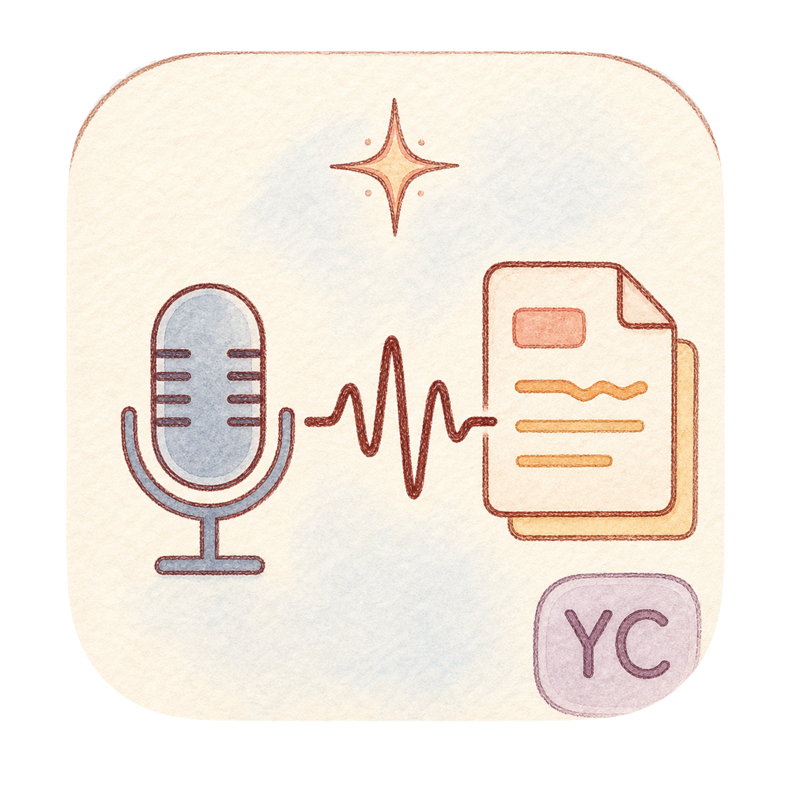

<p align="center">
  
</p>

<h1 align="center">NoType</h1>

<p align="center">
  <strong>Private, local dictation for macOS — speak naturally and keep typing.</strong>
</p>

<p align="center">
  <a href="https://github.com/ycl-2004/NoType/releases/latest"></a>
  <a href="https://github.com/ycl-2004/NoType/releases"></a>
  
  
  
</p>

<p align="center">
  <a href="https://github.com/ycl-2004/NoType/releases/latest/download/NoType-0.3.0-arm64.zip"><strong>⬇ Download for macOS</strong></a>
  ·
  <a href="https://github.com/ycl-2004/NoType/releases">Releases</a>
  ·
  <a href="#features">Features</a>
  ·
  <a href="#privacy">Privacy</a>
  ·
  <a href="#build-from-source">Build from source</a>
</p>

NoType is a native macOS menu-bar dictation app. Focus a text field, start
dictation, speak, and stop — NoType transcribes your voice locally and inserts
the result back into the app you were using.

The downloadable build includes the multilingual Whisper `large-v3` model and
its tokenizer. There is no account, no remote transcription API, and no model
download before your first dictation.

## Quick start

1. **[Download `NoType-0.3.0-arm64.zip`](https://github.com/ycl-2004/NoType/releases/latest/download/NoType-0.3.0-arm64.zip)** and unzip it. The archive is about 1.4 GB because the local speech model is included.
2. Move `NoType.app` to `/Applications`. On first launch, Control-click the app and choose **Open** — the current build is ad-hoc signed and not yet Apple-notarized.
3. Allow **Microphone** access for recording and **Accessibility** access for global shortcuts and direct text insertion.

Then focus any text field and double-tap **Command** to start. Double-tap it
again to stop, transcribe, and insert the result.

If Control-click → **Open** is unavailable, clear the quarantine flag:

```bash
xattr -dr com.apple.quarantine /Applications/NoType.app
open /Applications/NoType.app
```

### System requirements

- Apple Silicon Mac (`arm64`)
- macOS 15.0 or later
- About 4 GB of free space during download and extraction
- Microphone permission for recording
- Accessibility permission for global double-tap shortcuts and direct insertion

## Why NoType

- **Your voice stays on your Mac.** Audio is transcribed through WhisperKit and Core ML; temporary recordings are deleted after each attempt.
- **Chinese and English can share a sentence.** Auto mixed recognition is designed for code-switching, with Chinese-first and English-first modes when you want a stronger bias.
- **The model arrives ready.** The release contains the `large-v3` model and tokenizer, so first use does not depend on a separate setup or download.
- **It returns to the right place.** NoType remembers the focused input where dictation began. If that target changes, it keeps the transcript on the clipboard instead of inserting into the wrong field.
- **It stays out of the way.** No windows are required for normal use; status, modes, permissions, shortcuts, and diagnostics live in the menu bar.

## Features

**Dictation**

- Start and stop from anywhere with Double Command, Double Option, or Command + Shift + H.
- Automatic five-minute recording limit prevents an abandoned session from running indefinitely.
- Very short accidental recordings are ignored instead of being sent through transcription.
- The transcription model is prepared in the background after launch to reduce first-use waiting.

**Recognition**

- **Auto (中英混说)** for natural mixed Chinese and English speech.
- **中文优先** and **英文优先** for language-biased recognition.
- Follow-model, Simplified Chinese, or Traditional Chinese output preferences.
- A separate shortcut cycles recognition modes without opening the menu.

**Text delivery**

- Insert and copy, insert only, or copy only after a successful transcription.
- Direct Accessibility insertion with a paste fallback for apps that do not expose a compatible text field.
- Captured-target protection prevents a completed transcript from landing in a different chat or document.
- Clipboard-preserving fallback when insert-only mode needs to simulate a paste.

**Menu bar controls**

- Live idle, recording, transcribing, inserting, and error states.
- Recognition and Chinese-script markers visible in the menu-bar icon.
- Configurable dictation and recognition-mode shortcuts that persist across launches.
- Permission status, the latest diagnostic event, and direct access to the local debug log.

## Usage

1. Put the cursor where the transcript should appear.
2. Double-tap **Command** to start recording.
3. Speak normally. Mixed Chinese and English is supported in the default mode.
4. Double-tap **Command** again to stop.
5. NoType transcribes locally, returns to the captured app, and inserts or copies the transcript according to your selected success mode.

Open the menu-bar icon to change recognition mode, Chinese script, output
behavior, shortcuts, or permissions. The default shortcuts are:

| Action | Default | Other choices |
| --- | --- | --- |
| Start / stop dictation | Double Command | Double Option, Command + Shift + H, Disabled |
| Cycle recognition mode | Command + Shift + Y | Command + Option + Y, Control + Option + Y, Disabled |

## Privacy

- Speech recognition runs locally through WhisperKit and Core ML.
- NoType does not use a remote transcription API.
- The release build does not download a model at runtime.
- Temporary audio is removed after transcription succeeds or fails.
- There are no accounts, analytics, or telemetry in the app.
- Microphone access is used only for active dictation.
- Accessibility access is used for the global modifier shortcut, focused-target capture, and text insertion.
- The clipboard is touched only when the selected output mode or an insertion fallback requires it.

## Current release

NoType `0.3.0` is available as an Apple Silicon archive from the
[`v0.3.0`](https://github.com/ycl-2004/NoType/releases/tag/v0.3.0)
release.

| Artifact | Purpose |
| --- | --- |
| `NoType-0.3.0-arm64.zip` | Ready-to-run app with the Whisper model and tokenizer included |
| `NoType-0.3.0-arm64.zip.sha256` | SHA-256 checksum for download verification |

The app is approximately 1.5 GB after extraction. The model is distributed as a
GitHub Release asset and is intentionally not committed to this repository.

## FAQ

<details>
<summary>macOS says NoType cannot be opened because the developer cannot be verified</summary>

The current release is ad-hoc signed and not Apple-notarized. Control-click
`NoType.app`, choose **Open**, and confirm once. You can also run the `xattr`
command shown in [Quick start](#quick-start).

</details>

<details>
<summary>Why is the download so large?</summary>

NoType includes the Whisper `large-v3` `_turbo` Core ML package and its tokenizer.
The package includes an optional decoder-prefill model that reduces startup
decoding work. This makes the archive much larger, but it also means
transcription works locally on first launch without downloading a model or
sending speech to a server.

</details>

<details>
<summary>Why does NoType need Microphone and Accessibility permission?</summary>

**Microphone** permission lets NoType record while dictation is active.
**Accessibility** permission lets it observe the global modifier shortcut,
remember the focused input, and insert the finished transcript. Copy-only output
still needs Microphone access but does not require direct text insertion.

</details>

<details>
<summary>What happens if I switch chats or text fields while NoType is transcribing?</summary>

NoType tries to return to the input captured when dictation started. If that
specific target is no longer available, it copies the transcript instead of
risking insertion into a different conversation or document.

</details>

<details>
<summary>How do I uninstall NoType?</summary>

Quit NoType from the menu-bar icon, then move `/Applications/NoType.app` to the
Trash. You can revoke its permissions under **System Settings → Privacy &
Security → Microphone / Accessibility**.

</details>

## Build from source

<details>
<summary>Requirements, build commands, and release packaging</summary>

Requirements:

- macOS 15.0 or later
- Apple Silicon for the current release-packaging path
- Swift 6.1 or a compatible Xcode toolchain
- A local WhisperKit Core ML model and tokenizer for a self-contained release

Run the test suite:

```bash
swift test
```

Build a small local app bundle:

```bash
./scripts/build_app.sh
```

This creates `dist/NoType.app` without copying the large model. It is useful for
compile and bundle checks. A developer build without bundled resources uses the
fallback paths configured in `LocalWhisperPaths.swift`.

Build the self-contained release archive:

```bash
WHISPER_MODEL_DIR="/path/to/openai_whisper-large-v3-v20240930_turbo" \
WHISPER_TOKENIZER_DIR="/path/to/whisper-large-v3" \
./scripts/build_release.sh
```

The packaging script builds the current checkout, bundles the model and
tokenizer, signs the whole app bundle, and creates:

```text
dist/NoType.app
dist/NoType-0.3.0-arm64.zip
dist/NoType-0.3.0-arm64.zip.sha256
```

The default signature is ad-hoc. To use an installed Developer ID identity:

```bash
CODESIGN_IDENTITY="Developer ID Application: Your Name (TEAMID)" \
./scripts/build_release.sh
```

The script verifies the signature with `codesign --verify --deep --strict`.
Notarization is not automated yet; consult Apple's macOS distribution guidance
before treating a build as a public, notarized release.

</details>

## Project layout

- `Sources/Typeless/Audio/` — microphone capture and temporary recorded clips.
- `Sources/Typeless/Transcription/` — WhisperKit loading, language attempts, selection, and transcript cleanup.
- `Sources/Typeless/Accessibility/` — focused-target capture, direct insertion, clipboard handling, and paste fallback.
- `Sources/Typeless/Coordinator/` — dictation state transitions and orchestration.
- `Sources/Typeless/App/` — menu-bar UI, permissions, diagnostics, and app lifecycle.
- `Sources/Typeless/Hotkey/` — Carbon shortcuts and modifier double-tap detection.
- `Tests/TypelessTests/` — unit coverage for transcription, coordination, shortcuts, state, permissions, and menu presentation.
- `Packaging/Info.plist` — app identity, version, permissions text, and minimum macOS version.
- `scripts/` — local app and self-contained release builds.
- `docs/decisions/` — product and engineering decision records.

## Known limitations

- The downloadable release supports Apple Silicon only.
- macOS 15.0 or later is required.
- The current public build is ad-hoc signed and not notarized.
- There is no in-app updater; new versions are installed manually.
- The release model is fixed to Whisper `large-v3`; model switching is not exposed in the app.

## Documentation

- [Changelog](CHANGELOG.md) — shipped user-facing changes.
- [Known issues](docs/known-issues.md) — understood limitations and future directions.
- [ADR-001: Configurable shortcut input](docs/decisions/001-configurable-shortcut-input.md) — why NoType uses curated shortcuts and modifier double-taps.
- [ADR-002: Portable release packaging](docs/decisions/002-portable-release-packaging.md) — why releases bundle the model instead of downloading it at runtime.

## Third-party terms

NoType uses WhisperKit. Its license is included at
[`Vendor/WhisperKit-main/LICENSE`](Vendor/WhisperKit-main/LICENSE).
